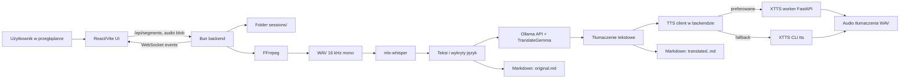
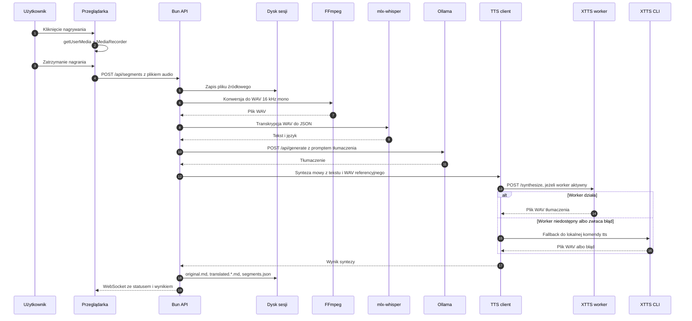
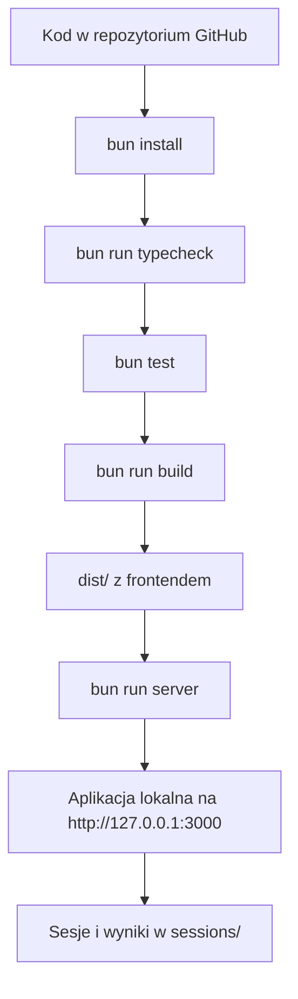
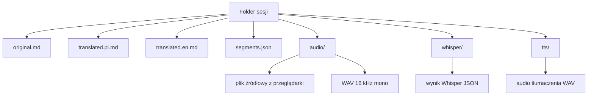
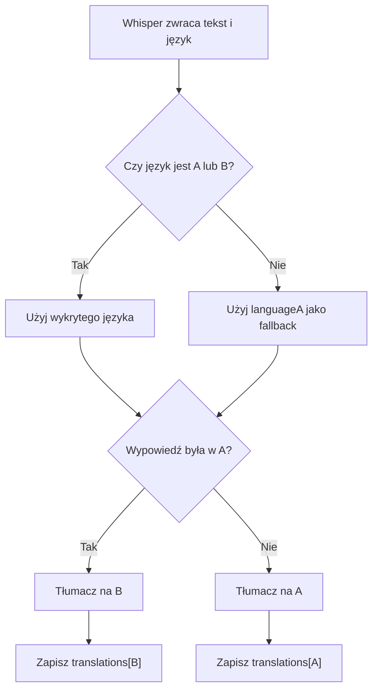

# Paper: lokalny prototyp tłumacza rozmowy

Data opracowania: 2026-06-23

Ten dokument opisuje, jak odtworzyć, uruchomić i wdrożyć prototyp lokalnego tłumacza rozmowy na komputerze Mac. Jest przeznaczony dla osób, które chcą zrozumieć projekt i uruchomić go we własnym środowisku, także wtedy, gdy nie są zawodowymi programistami.

Dokumentacja zakłada, że repozytorium zawiera aplikację `tlumacz-lokalny`: frontend React/Vite, backend Bun, lokalną transkrypcję audio przez `mlx-whisper`, lokalne tłumaczenie przez Ollama i TranslateGemma oraz opcjonalną lokalną syntezę mowy przez XTTS-v2. Synteza mowy może działać szybciej przez lokalny worker Python/FastAPI, a gdy worker nie jest dostępny, backend wraca do wolniejszego trybu CLI `tts`.

## 1. Streszczenie

Prototyp działa jako lokalna aplikacja webowa uruchamiana na Macu. Użytkownik otwiera interfejs w przeglądarce, wybiera dwa języki i nagrywa wypowiedź z mikrofonu. Aplikacja:

1. zapisuje nagrany fragment audio w folderze sesji,
2. konwertuje audio do formatu WAV 16 kHz mono przez FFmpeg,
3. rozpoznaje mowę lokalnie przez `mlx-whisper`,
4. wykrywa, czy wypowiedź jest w języku A czy B,
5. tłumaczy tekst lokalnie przez Ollama i model TranslateGemma,
6. opcjonalnie generuje plik WAV z tłumaczeniem przez XTTS-v2, najpierw przez worker, a w razie problemu przez CLI,
7. zapisuje transkrypcję i tłumaczenia do plików Markdown.

Najważniejsza filozofia projektu: dane rozmowy nie muszą opuszczać komputera użytkownika po pobraniu zależności i modeli. To ogranicza zależność od zewnętrznych API, ale przenosi odpowiedzialność za moc obliczeniową, instalację modeli, miejsce na dysku i prywatność na lokalne środowisko.

## 2. Dla kogo jest ten dokument

Ten dokument jest dla:

- osób, które chcą uruchomić prototyp na swoim Macu,
- zespołów, które chcą przygotować podobny lokalny tłumacz w innym miejscu,
- osób nietechnicznych, które potrzebują zrozumieć przepływ danych i decyzje projektowe,
- inżynierów, którzy będą rozwijać repozytorium, pipeline CI/CD lub wdrożenie lokalne.

Dokument nie jest instrukcją trenowania własnych modeli. Prototyp używa gotowych modeli i lokalnych narzędzi inferencyjnych.

## 3. Architektura w skrócie



Elementy systemu:

- `src/` - interfejs użytkownika w React.
- `server/` - lokalny backend HTTP/WebSocket uruchamiany przez Bun.
- `scripts/dev.ts` - uruchamia backend i frontend razem w trybie deweloperskim.
- `scripts/xtts_worker.py` - opcjonalny lokalny worker XTTS, który ładuje model raz i obsługuje kolejne syntezy przez HTTP.
- `server/tts-client.ts` - wybiera worker XTTS, a gdy worker nie działa, przełącza się na CLI `tts`.
- `tests/` - testy jednostkowe dla generowania Markdown i identyfikatorów sesji.
- `sessions/` - lokalne dane rozmów, transkrypcje i audio; folder nie powinien być publikowany na GitHubie.
- `dist/` - produkcyjny build frontendu; folder nie powinien być commitowany.

## 4. Pipeline aplikacji

Pipeline oznacza tutaj pełną drogę danych od mikrofonu do plików wynikowych.



Kolejka przetwarzania jest sekwencyjna. Jeżeli użytkownik doda kilka fragmentów, backend zapisuje je do kolejki i przetwarza po jednym. To upraszcza prototyp i zmniejsza ryzyko przeciążenia lokalnego komputera przez równoległe uruchamianie Whispera, modelu tłumaczącego i TTS.

## 5. Pipeline repozytorium

Pipeline repozytorium to sposób pracy od kodu do działającej aplikacji.



W praktyce są dwa tryby:

- tryb pracy lokalnej: `bun run dev`, czyli frontend na `127.0.0.1:5173` i backend na `127.0.0.1:3000`,
- tryb produkcyjny lokalny: `bun run build`, a potem `bun run server`; backend serwuje wtedy zbudowany frontend z `dist/`.

## 6. Modele i narzędzia AI

| Warstwa | Narzędzie lub model | Domyślna wartość w prototypie | Rola |
| --- | --- | --- | --- |
| ASR, speech-to-text | `mlx-whisper` | binarka: `~/audio-ai/whisper-mlx/.venv/bin/mlx_whisper` | Uruchamia Whisper lokalnie na Macu, szczególnie sensownie na Apple Silicon. |
| Model ASR | `mlx-community/whisper-large-v3-mlx` | `WHISPER_MODEL=mlx-community/whisper-large-v3-mlx` | Rozpoznawanie mowy i zwrot JSON z tekstem oraz językiem. |
| Tłumaczenie tekstu | Ollama API | `OLLAMA_URL=http://127.0.0.1:11434` | Lokalny serwer LLM; backend wysyła prompt do `/api/generate`. |
| Model tłumaczenia | TranslateGemma GGUF | `OLLAMA_MODEL=hf.co/mradermacher/translategemma-4b-it-GGUF:Q4_K_M` | Model tłumaczący używany przez Ollama. |
| Konwersja audio | FFmpeg | `FFMPEG_PATH=ffmpeg` | Normalizacja nagrania do WAV 16 kHz mono. |
| TTS, text-to-speech | Coqui XTTS-v2 | `XTTS_MODEL=tts_models/multilingual/multi-dataset/xtts_v2` | Generuje głosowe tłumaczenie na bazie tekstu i próbki głosu z oryginalnego WAV. |
| Szybszy TTS | XTTS worker FastAPI/Uvicorn | `XTTS_WORKER_URL=http://127.0.0.1:8765` | Ładuje model XTTS raz i przyjmuje kolejne żądania syntezy przez HTTP. |
| Fallback TTS | CLI `tts` | `XTTS_PATH=~/audio-ai/xtts/.venv/bin/tts` | Wolniejsza ścieżka awaryjna, używana gdy worker jest wyłączony albo nie odpowiada. |
| Format wyników | Markdown | `original.md`, `translated.<lang>.md` | Eksport rozmowy do plików łatwych do czytania na GitHubie i lokalnie. |

Dlaczego takie modele:

- `mlx-whisper` wykorzystuje ekosystem MLX, który jest zoptymalizowany pod komputery Mac z Apple Silicon.
- Whisper jest dobrym wyborem do rozpoznawania wielojęzycznej mowy.
- TranslateGemma jest rodziną otwartych modeli tłumaczeniowych opartych na Gemma 3; wariant 4B jest kompromisem między jakością a możliwością uruchomienia lokalnie.
- GGUF w Ollamie upraszcza lokalne uruchomienie modelu bez pisania własnego serwera inferencyjnego.
- XTTS-v2 pozwala wygenerować lokalną odpowiedź głosową, ale tylko dla języków wspieranych przez model.
- Worker XTTS jest szybszy przy wielu segmentach, bo nie musi ładować modelu od nowa dla każdej wypowiedzi.

Ważne: pierwsze uruchomienie może trwać długo, bo narzędzia pobierają modele do lokalnych cache'y. Trzeba też zaplanować miejsce na dysku. Same modele LLM, ASR i TTS mogą zajmować od kilku do kilkudziesięciu GB zależnie od wariantu.

## 7. Wspierane języki

W UI można wybrać następujące kody języków: `pl`, `en`, `de`, `es`, `fr`, `it`, `pt`, `nl`, `cs`, `hu`, `tr`, `uk`, `ru`, `ar`, `zh`, `ja`, `ko`, `hi`, `vi`, `th`, `id`, `ms`, `tl`, `fa`, `he`.

Transkrypcja i tłumaczenie tekstowe są obsługiwane dla pełnej listy skonfigurowanej w aplikacji. Odtwarzanie głosowe zależy od XTTS-v2 i w tym prototypie jest włączone dla języków z polem `ttsCode`: `pl`, `en`, `de`, `es`, `fr`, `it`, `pt`, `nl`, `cs`, `hu`, `tr`, `ru`, `ar`, `zh`, `ja`, `ko`, `hi`.

Dla języków bez lokalnego TTS aplikacja nadal zapisuje i pokazuje tłumaczenie tekstowe, ale nie wygeneruje pliku audio tłumaczenia.

## 8. Wymagania sprzętowe i systemowe

Rekomendowane środowisko:

- Mac z Apple Silicon, np. M1/M2/M3/M4, najlepiej z co najmniej 16 GB RAM,
- macOS 14 Sonoma lub nowszy, jeżeli używasz aktualnej aplikacji Ollama,
- kilka-kilkadziesiąt GB wolnego miejsca na modele i sesje,
- mikrofon systemowy,
- przeglądarka obsługująca `getUserMedia` i `MediaRecorder`, np. Chrome, Edge lub Safari,
- internet tylko do instalacji narzędzi i pobrania modeli; samo przetwarzanie może działać lokalnie.

Na Macu Intel część narzędzi może działać wolniej, a `mlx-whisper` jest szczególnie sensowny na Apple Silicon.

## 9. Przygotowanie Maca

Poniższe kroki wykonuje się w aplikacji Terminal.

### 9.1. Narzędzia Apple Command Line Tools

Jeżeli Mac nie ma narzędzi developerskich:

```bash
xcode-select --install
```

To instaluje podstawowe kompilatory i narzędzia wymagane przez część pakietów.

### 9.2. Homebrew

Homebrew jest menedżerem pakietów dla macOS. Jeżeli go nie masz:

```bash
/bin/bash -c "$(curl -fsSL https://raw.githubusercontent.com/Homebrew/install/HEAD/install.sh)"
```

Po instalacji sprawdź:

```bash
brew --version
```

### 9.3. FFmpeg

FFmpeg jest potrzebny, bo przeglądarka może nagrać audio w formacie WebM/MP4, a Whisper najlepiej dostaje jednolity WAV.

```bash
brew install ffmpeg
ffmpeg -version
```

### 9.4. Bun

Bun uruchamia backend, instaluje paczki JavaScript/TypeScript i uruchamia testy.

```bash
curl -fsSL https://bun.com/install | bash
```

Otwórz nowe okno terminala i sprawdź:

```bash
bun --version
bun --revision
```

Alternatywnie Bun można zainstalować przez Homebrew lub npm, ale w projekcie wystarczy, żeby komenda `bun` była dostępna w terminalu.

### 9.5. uv i Python

`uv` ułatwia tworzenie osobnych środowisk Python dla Whispera i XTTS. Osobne środowiska są ważne, bo modele audio mają wiele zależności i nie powinny mieszać się z systemowym Pythonem.

```bash
curl -LsSf https://astral.sh/uv/install.sh | sh
```

Otwórz nowe okno terminala i sprawdź:

```bash
uv --version
```

Możesz pozwolić `uv` zarządzać Pythonem:

```bash
uv python install 3.12
```

## 10. Instalacja lokalnych modeli

W tym prototypie przyjęto katalog bazowy `~/audio-ai/`. Możesz użyć innego katalogu, ale wtedy ustaw odpowiednie zmienne środowiskowe opisane w sekcji 14.

### 10.1. mlx-whisper

```bash
mkdir -p ~/audio-ai/whisper-mlx
cd ~/audio-ai/whisper-mlx
uv venv --python 3.12 .venv
uv pip install --python .venv/bin/python mlx-whisper
.venv/bin/mlx_whisper --help
```

Domyślna ścieżka oczekiwana przez aplikację:

```text
~/audio-ai/whisper-mlx/.venv/bin/mlx_whisper
```

Model domyślny:

```text
mlx-community/whisper-large-v3-mlx
```

Pierwsza transkrypcja może pobrać model automatycznie. Jeżeli chcesz pobrać go wcześniej:

```bash
uv pip install --python .venv/bin/python "huggingface_hub[hf_xet]"
.venv/bin/huggingface-cli download mlx-community/whisper-large-v3-mlx
```

### 10.2. Ollama i TranslateGemma

Zainstaluj Ollamę z oficjalnej aplikacji macOS albo poleceniem instalacyjnym ze strony Ollama.

Po instalacji sprawdź, czy serwer działa:

```bash
curl http://127.0.0.1:11434/api/tags
```

Pobierz lub uruchom model GGUF używany przez prototyp:

```bash
ollama run hf.co/mradermacher/translategemma-4b-it-GGUF:Q4_K_M
```

Ollama pobiera model przy pierwszym uruchomieniu. Po pobraniu możesz zakończyć interaktywną sesję modelu przez `Ctrl+D` albo komendą `/bye`, zależnie od wersji klienta.

Sprawdzenie modelu:

```bash
ollama list
curl http://127.0.0.1:11434/api/tags
```

Krótki test API:

```bash
curl http://127.0.0.1:11434/api/generate \
  -H "Content-Type: application/json" \
  -d '{
    "model": "hf.co/mradermacher/translategemma-4b-it-GGUF:Q4_K_M",
    "prompt": "Translate from Polish to English.\nReturn only the translated text.\n\nDzień dobry.",
    "stream": false,
    "options": { "temperature": 0 }
  }'
```

Jeżeli odpowiedź zawiera pole `response`, warstwa tłumaczenia działa.

### 10.3. XTTS-v2

XTTS jest opcjonalny dla sensu prototypu, ale wymagany do lokalnego odtwarzania głosowego tłumaczenia. Bez XTTS nadal działają transkrypcja, tłumaczenie i eksport Markdown.

```bash
mkdir -p ~/audio-ai/xtts
cd ~/audio-ai/xtts
uv venv --python 3.12 .venv
uv pip install --python .venv/bin/python torch torchaudio torchcodec --torch-backend=auto
uv pip install --python .venv/bin/python "coqui-tts[languages]"
uv pip install --python .venv/bin/python fastapi uvicorn
.venv/bin/tts --list_models | head
```

Domyślna ścieżka oczekiwana przez aplikację:

```text
~/audio-ai/xtts/.venv/bin/tts
```

Model domyślny:

```text
tts_models/multilingual/multi-dataset/xtts_v2
```

Ten sam venv obsługuje dwa tryby:

- worker: `~/audio-ai/xtts/.venv/bin/python scripts/xtts_worker.py`,
- fallback CLI: `~/audio-ai/xtts/.venv/bin/tts`.

Worker wymaga `fastapi` i `uvicorn`. Tryb CLI wymaga komendy `tts`, którą dostarcza Coqui TTS.

Dla języka chińskiego może być potrzebne dodatkowe narzędzie romanizacji:

```bash
uv pip install --python ~/audio-ai/xtts/.venv/bin/python pypinyin
```

Ważne prawnie i etycznie: XTTS potrafi klonować głos z krótkiej próbki. Używaj tej funkcji tylko wtedy, gdy masz prawo nagrywać osobę i przetwarzać jej głos. Przed użyciem produkcyjnym przeczytaj licencję modelu Coqui XTTS-v2.

## 11. Pobranie repozytorium

Po opublikowaniu projektu na GitHubie typowy użytkownik zrobi:

```bash
git clone https://github.com/TWOJA_ORGANIZACJA/TWOJE_REPO.git
cd TWOJE_REPO
```

Zastąp `TWOJA_ORGANIZACJA/TWOJE_REPO` rzeczywistą nazwą konta i repozytorium na GitHubie.

Jeżeli pracujesz lokalnie w tym katalogu, wystarczy wejść do katalogu projektu:

```bash
cd /sciezka/do/tlumacz-lokalny
```

Następnie zainstaluj zależności JavaScript:

```bash
bun install
```

## 12. Uruchomienie w trybie deweloperskim

```bash
bun run dev
```

Domyślne adresy:

- frontend: `http://127.0.0.1:5173`,
- backend/API: `http://127.0.0.1:3000`,
- WebSocket: `ws://127.0.0.1:3000/ws`,
- XTTS worker: zwykle `http://127.0.0.1:8765`, chyba że port jest zajęty albo ustawiono `XTTS_WORKER_URL`.

W trybie `bun run dev` skrypt `scripts/dev.ts` domyślnie próbuje uruchomić `scripts/xtts_worker.py` przez `XTTS_PYTHON`. Jeżeli Python workera nie istnieje, aplikacja nadal startuje, a backend użyje fallbacku CLI `tts`.

Worker można wyłączyć:

```bash
XTTS_WORKER_ENABLED=0 bun run dev
```

Otwórz frontend w przeglądarce. Przy pierwszym nagrywaniu przeglądarka poprosi o dostęp do mikrofonu. Trzeba go zaakceptować.

Po uruchomieniu sprawdź panel statusu w UI albo endpoint:

```bash
curl http://127.0.0.1:3000/api/health
```

Endpoint zdrowia sprawdza:

- Bun,
- FFmpeg,
- `mlx-whisper`,
- XTTS,
- XTTS worker,
- Ollama i widoczność modelu TranslateGemma,
- możliwość zapisu do folderu sesji.

## 13. Uruchomienie produkcyjne lokalne

Ten wariant jest przydatny, gdy nie chcesz mieć dwóch portów i serwera Vite.

```bash
bun run build
bun run server
```

Po `bun run build` powstaje folder `dist/`. Backend Bun sprawdza, czy istnieje `dist/index.html`; jeżeli tak, serwuje frontend z tego katalogu.

Domyślny adres:

```text
http://127.0.0.1:3000
```

Jeżeli port 3000 jest zajęty:

```bash
PORT=3010 bun run server
```

Bezpośrednie `bun run server` nie startuje workera XTTS. Jeżeli chcesz w trybie produkcyjnym lokalnym użyć szybszego workera, uruchom go w osobnym terminalu przed backendem:

```bash
XTTS_WORKER_HOST=127.0.0.1 \
XTTS_WORKER_PORT=8765 \
XTTS_MODEL=tts_models/multilingual/multi-dataset/xtts_v2 \
XTTS_DEVICE=auto \
~/audio-ai/xtts/.venv/bin/python scripts/xtts_worker.py
```

Następnie uruchom backend z włączonym workerem:

```bash
XTTS_WORKER_ENABLED=1 \
XTTS_WORKER_URL=http://127.0.0.1:8765 \
bun run server
```

Jeżeli worker nie odpowie albo zwróci błąd, backend spróbuje wygenerować audio przez CLI `tts`.

Jeżeli chcesz udostępnić aplikację w sieci lokalnej:

```bash
HOST=0.0.0.0 PORT=3000 bun run server
```

Ostrożnie z `HOST=0.0.0.0`: prototyp nie ma logowania ani autoryzacji. Każdy w tej samej sieci, kto ma dostęp do portu, może korzystać z aplikacji i potencjalnie odczytywać wyniki bieżącej sesji. Dodatkowo mikrofon w przeglądarce zwykle wymaga bezpiecznego kontekstu; `localhost` jest traktowany specjalnie, ale dostęp przez zwykłe HTTP z innego urządzenia może nie dostać uprawnień mikrofonu. Do szerszego wdrożenia trzeba dodać HTTPS, uwierzytelnianie i politykę dostępu.

## 14. Konfiguracja przez zmienne środowiskowe

Konfiguracja znajduje się w `server/config.ts`. Najważniejsze zmienne:

| Zmienna | Domyślnie | Znaczenie |
| --- | --- | --- |
| `PORT` | `3000` | Port backendu. |
| `HOST` | `127.0.0.1` | Interfejs sieciowy backendu. |
| `IDLE_TIMEOUT_SECONDS` | `255` | Timeout połączeń WebSocket/HTTP w Bun. |
| `MAX_AUDIO_BYTES` | `209715200` | Maksymalny rozmiar pojedynczego audio, domyślnie 200 MB. |
| `SEGMENT_SECONDS` | `600` | Maksymalna długość jednego nagrania w sekundach. |
| `SESSIONS_DIR` | `sessions` | Folder wyników rozmów. |
| `FFMPEG_PATH` | `ffmpeg` | Ścieżka do FFmpeg. |
| `OLLAMA_URL` | `http://127.0.0.1:11434` | Adres lokalnego serwera Ollama. |
| `OLLAMA_MODEL` | `hf.co/mradermacher/translategemma-4b-it-GGUF:Q4_K_M` | Model tłumaczenia. |
| `WHISPER_PATH` | `~/audio-ai/whisper-mlx/.venv/bin/mlx_whisper` | Binarka `mlx_whisper`. |
| `WHISPER_MODEL` | `mlx-community/whisper-large-v3-mlx` | Model ASR. |
| `XTTS_PYTHON` | `~/audio-ai/xtts/.venv/bin/python` | Python używany do uruchamiania workera XTTS w trybie dev. |
| `XTTS_PATH` | `~/audio-ai/xtts/.venv/bin/tts` | Binarka `tts` z Coqui. |
| `XTTS_MODEL` | `tts_models/multilingual/multi-dataset/xtts_v2` | Model TTS. |
| `XTTS_TIMEOUT_MS` | `900000` | Timeout generowania audio TTS, domyślnie 15 minut. |
| `XTTS_WORKER_ENABLED` | w `server`: wyłączony, w `bun run dev`: włączony | Czy backend ma próbować workera XTTS przed CLI. |
| `XTTS_WORKER_URL` | `http://127.0.0.1:8765` | Adres workera XTTS. |
| `XTTS_WORKER_TIMEOUT_MS` | wartość `XTTS_TIMEOUT_MS` albo `900000` | Timeout żądania HTTP do workera. |
| `XTTS_DEVICE` | `auto` | Urządzenie dla workera: `auto`, `cuda`, `mps` albo `cpu`. |

Przykład uruchomienia z własnymi ścieżkami:

```bash
WHISPER_PATH="$HOME/models/whisper/.venv/bin/mlx_whisper" \
XTTS_PATH="$HOME/models/xtts/.venv/bin/tts" \
XTTS_PYTHON="$HOME/models/xtts/.venv/bin/python" \
SESSIONS_DIR="$HOME/tlumacz-sesje" \
bun run server
```

## 15. Struktura danych sesji

Każda rozmowa zapisuje się jako oddzielny folder. Przykład:

```text
sessions/20260623_sesja_0017_id_9d8a62fa/
├── original.md
├── translated.pl.md
├── translated.en.md
├── segments.json
├── audio/
│   ├── <segment-id>.webm
│   └── <segment-id>.wav
├── whisper/
│   └── <segment-id>.json
└── tts/
    └── <segment-id>.<lang>.wav
```

Znaczenie plików:

- `original.md` - oryginalna transkrypcja rozmowy z oznaczeniem języka wykrytego przez Whispera.
- `translated.<lang>.md` - cała rozmowa w jednym z dwóch języków sesji.
- `segments.json` - techniczny stan segmentów, statusy, czasy przetwarzania i ścieżki plików.
- `audio/` - źródłowy blob z przeglądarki i WAV po konwersji FFmpeg.
- `whisper/` - JSON wygenerowany przez `mlx-whisper`.
- `tts/` - wygenerowane audio tłumaczenia.



Folder `sessions/` zawiera potencjalnie prywatne rozmowy i głosy. Nie commituj go do GitHuba.

## 16. API backendu

| Endpoint | Metoda | Rola |
| --- | --- | --- |
| `/api/health` | `GET` | Sprawdza lokalne zależności i model Ollamy. |
| `/api/config` | `GET` | Zwraca listę języków i limity audio. |
| `/api/session` | `GET` | Zwraca aktualny stan sesji. |
| `/api/session/reset` | `POST` | Tworzy nową sesję dla pary języków. |
| `/api/segments` | `POST` | Przyjmuje nagranie audio i dodaje segment do kolejki. |
| `/api/segments/:id/retry` | `POST` | Ponawia cały pipeline dla segmentu. |
| `/api/segments/:id/audio/translation/retry` | `POST` | Ponawia tylko syntezę audio tłumaczenia. |
| `/api/segments/:id/audio/original` | `GET` | Zwraca oryginalny WAV segmentu. |
| `/api/segments/:id/audio/translation` | `GET` | Zwraca WAV tłumaczenia albo uruchamia jego przygotowanie. |
| `/api/files/:name` | `GET` | Zwraca dozwolony plik sesji, np. Markdown lub JSON. |
| `/ws` | WebSocket | Wysyła do UI aktualizacje sesji, segmentów, statusów i błędów. |

## 17. Logika języków i kierunku tłumaczenia

Sesja ma dwa języki: `languageA` i `languageB`. Użytkownik może mówić w dowolnym z nich. Pipeline działa tak:



Jeżeli Whisper wykryje język spoza pary wybranej w sesji, aplikacja używa `languageA` jako bezpiecznego fallbacku. To zachowanie jest proste i czytelne, ale w wersji produkcyjnej można rozważyć bardziej widoczny komunikat dla użytkownika.

## 18. GitHub: przygotowanie repozytorium

Przed publikacją sprawdź, czy `.gitignore` zawiera co najmniej:

```gitignore
node_modules
dist
sessions
.DS_Store
*.log
```

To chroni przed publikacją zależności, buildów i prywatnych sesji.

Typowa inicjalizacja repo:

```bash
git init
git add .
git commit -m "Initial local translator prototype"
git branch -M main
git remote add origin git@github.com:TWOJA_ORGANIZACJA/TWOJE_REPO.git
git push -u origin main
```

Przed każdym pushem:

```bash
bun run typecheck
bun test
bun run build
git status --short
```

Jeżeli w `git status` widzisz `sessions/`, audio, prywatne transkrypcje lub pliki `.wav`, zatrzymaj się i popraw `.gitignore` albo usuń je ze stage'a.

## 19. Proponowany pipeline CI na GitHub Actions

Ten pipeline sprawdza tylko część kodową: TypeScript, testy i build frontendu. Nie uruchamia modeli, bo to wymaga dużych plików, mikrofonu, Ollamy i lokalnego Maca.

Przykładowy plik `.github/workflows/ci.yml`:

```yaml
name: CI

on:
  push:
    branches: [main]
  pull_request:

jobs:
  verify:
    runs-on: ubuntu-latest
    steps:
      - name: Checkout
        uses: actions/checkout@v4

      - name: Setup Bun
        uses: oven-sh/setup-bun@v2

      - name: Install dependencies
        run: bun install --frozen-lockfile

      - name: Typecheck
        run: bun run typecheck

      - name: Test
        run: bun test

      - name: Build
        run: bun run build
```

Dla pełnego testu end-to-end potrzebny byłby osobny self-hosted runner na Macu z pobranymi modelami. Wtedy można dodać test, który:

1. uruchamia Ollamę,
2. sprawdza model przez `/api/tags`,
3. uruchamia backend,
4. wysyła krótki plik audio testowy,
5. czeka na status `done`,
6. sprawdza, czy powstały pliki Markdown.

## 20. Wdrożenie lokalne jako aplikacja stanowiskowa

Najprostszy wariant wdrożenia:

1. Przygotuj Maca według sekcji 9 i 10.
2. Sklonuj repozytorium.
3. Uruchom `bun install`.
4. Uruchom `bun run build`.
5. Opcjonalnie uruchom worker XTTS w osobnym procesie.
6. Uruchom backend poleceniem `bun run server`.
7. Otwórz `http://127.0.0.1:3000`.
8. Wykonaj próbne nagranie.
9. Sprawdź, czy powstały pliki w `sessions/`.

Można przygotować prosty skrypt startowy, np. `start-local.sh`:

```bash
#!/usr/bin/env bash
set -euo pipefail

cd "$(dirname "$0")"
export HOST="${HOST:-127.0.0.1}"
export PORT="${PORT:-3000}"
export OLLAMA_URL="${OLLAMA_URL:-http://127.0.0.1:11434}"

bun run server
```

Wariant bardziej dojrzały dla organizacji:

- osobny użytkownik systemowy na Macu,
- stały katalog modeli, np. `/Users/shared/audio-ai`,
- stały katalog sesji na zaszyfrowanym dysku,
- osobny proces dla `scripts/xtts_worker.py`, jeżeli TTS ma być szybki,
- rotacja lub archiwizacja sesji,
- automatyczne uruchamianie przez `launchd`,
- monitoring wolnego miejsca na dysku,
- dokument zgód na nagrywanie i przetwarzanie głosu.

## 21. Prywatność i bezpieczeństwo

Projekt jest lokalny, ale nie jest automatycznie bezpieczny produkcyjnie. Najważniejsze zasady:

- Nie publikuj folderu `sessions/`.
- Nie publikuj prywatnych plików `.wav`, `.webm`, `.json` i transkrypcji.
- Nie udostępniaj `HOST=0.0.0.0` w niezaufanej sieci.
- Jeżeli aplikacja ma działać dla wielu osób, dodaj logowanie, TLS i kontrolę dostępu do sesji.
- Poinformuj użytkowników, że mikrofon nagrywa rozmowę i że głos może być użyty jako próbka do TTS.
- Przeczytaj licencje modeli: TranslateGemma, konkretnego GGUF, Whisper/MLX oraz XTTS-v2.
- Sprawdź, czy użycie modeli jest zgodne z polityką Twojej organizacji.

## 22. Typowe problemy

### `mlx-whisper` nie znaleziony

Objaw: `/api/health` pokazuje brak `mlx-whisper`.

Sprawdź:

```bash
ls -l ~/audio-ai/whisper-mlx/.venv/bin/mlx_whisper
```

Jeżeli plik jest gdzie indziej:

```bash
WHISPER_PATH="/inna/sciezka/mlx_whisper" bun run server
```

### Ollama działa, ale model nie jest widoczny

Sprawdź:

```bash
ollama list
curl http://127.0.0.1:11434/api/tags
```

Jeżeli model ma inną nazwę, uruchom backend z dopasowaną zmienną:

```bash
OLLAMA_MODEL="nazwa-modelu-z-ollama-list" bun run server
```

### Pierwsze tłumaczenie jest bardzo wolne

To normalne przy pierwszym użyciu. Model może się pobierać lub ładować do pamięci. Kolejne tłumaczenia zwykle są szybsze, o ile model pozostaje aktywny w Ollamie.

### XTTS nie generuje audio dla języka

Nie każdy język z listy aplikacji ma `ttsCode`. Wtedy tekst tłumaczenia jest gotowy, ale audio jest pominięte. To oczekiwane zachowanie.

### XTTS worker nie startuje

Sprawdź, czy istnieje Python workera:

```bash
ls -l ~/audio-ai/xtts/.venv/bin/python
```

Sprawdź zależności:

```bash
uv pip install --python ~/audio-ai/xtts/.venv/bin/python fastapi uvicorn
```

Uruchom worker ręcznie, żeby zobaczyć pełny błąd:

```bash
XTTS_DEVICE=auto ~/audio-ai/xtts/.venv/bin/python scripts/xtts_worker.py
```

Jeżeli worker nie działa, możesz go wyłączyć i używać fallbacku CLI:

```bash
XTTS_WORKER_ENABLED=0 bun run dev
```

### Worker działa wolno na Macu

Spróbuj wymusić urządzenie:

```bash
XTTS_DEVICE=mps bun run dev
```

Jeżeli MPS powoduje błędy zależne od operacji PyTorch, użyj:

```bash
XTTS_DEVICE=cpu bun run dev
```

### Błąd dla chińskiego TTS

Zainstaluj `pypinyin`:

```bash
uv pip install --python ~/audio-ai/xtts/.venv/bin/python pypinyin
```

### Przeglądarka blokuje mikrofon

Sprawdź:

- czy aplikacja jest otwarta na `http://127.0.0.1`,
- czy przeglądarka ma zgodę na mikrofon,
- czy inna aplikacja nie blokuje mikrofonu,
- czy używasz obsługiwanej przeglądarki.

### Port 3000 jest zajęty

W trybie dev skrypt szuka wolnego portu backendu od 3000 do 3049. W trybie produkcyjnym ustaw ręcznie:

```bash
PORT=3010 bun run server
```

## 23. Jak rozwijać prototyp

Najbardziej naturalne następne kroki:

- dodać test end-to-end z krótkim plikiem audio testowym,
- dodać lepszą obsługę przerwania długiego segmentu,
- dodać widoczny wybór modelu tłumaczenia w UI,
- zapisywać metadane wersji modeli w `segments.json`,
- dodać lokalne czyszczenie starych sesji,
- dodać tryb bez TTS dla słabszych komputerów,
- dodać uwierzytelnianie, jeżeli aplikacja ma działać poza `localhost`,
- przygotować paczkę instalacyjną lub skrypt bootstrap dla Maca.

## 24. Minimalna ścieżka od zera

Jeżeli chcesz tylko najszybciej odtworzyć projekt na Macu:

```bash
# 1. Narzędzia bazowe
xcode-select --install
/bin/bash -c "$(curl -fsSL https://raw.githubusercontent.com/Homebrew/install/HEAD/install.sh)"
brew install ffmpeg
curl -fsSL https://bun.com/install | bash
curl -LsSf https://astral.sh/uv/install.sh | sh
uv python install 3.12

# 2. Whisper
mkdir -p ~/audio-ai/whisper-mlx
cd ~/audio-ai/whisper-mlx
uv venv --python 3.12 .venv
uv pip install --python .venv/bin/python mlx-whisper

# 3. XTTS
mkdir -p ~/audio-ai/xtts
cd ~/audio-ai/xtts
uv venv --python 3.12 .venv
uv pip install --python .venv/bin/python torch torchaudio torchcodec --torch-backend=auto
uv pip install --python .venv/bin/python "coqui-tts[languages]"
uv pip install --python .venv/bin/python fastapi uvicorn
uv pip install --python .venv/bin/python pypinyin

# 4. Ollama + model
# Zainstaluj Ollama z https://ollama.com/download/mac, uruchom aplikację,
# a potem pobierz model:
ollama run hf.co/mradermacher/translategemma-4b-it-GGUF:Q4_K_M

# 5. Repo
git clone https://github.com/TWOJA_ORGANIZACJA/TWOJE_REPO.git
cd TWOJE_REPO
bun install
bun run dev
```

Po uruchomieniu otwórz `http://127.0.0.1:5173`.

## 25. Źródła

Źródła techniczne i miejsca pobierania:

- Bun installation: https://bun.com/docs/installation
- Bun WebSockets: https://bun.com/docs/runtime/http/websockets
- Vite production build: https://vite.dev/guide/build
- React `createRoot`: https://react.dev/reference/react-dom/client/createRoot
- Homebrew: https://brew.sh/
- FFmpeg Homebrew formula: https://formulae.brew.sh/formula/ffmpeg
- FFmpeg download: https://ffmpeg.org/download.html
- uv installation: https://docs.astral.sh/uv/getting-started/installation/
- uv Python management: https://docs.astral.sh/uv/guides/install-python/
- Ollama macOS: https://docs.ollama.com/macos
- Ollama generate API: https://docs.ollama.com/api/generate
- Ollama list models API: https://docs.ollama.com/api/tags
- Hugging Face GGUF with Ollama: https://huggingface.co/docs/hub/ollama
- Google TranslateGemma 4B model card: https://huggingface.co/google/translategemma-4b-it
- TranslateGemma GGUF used by this prototype: https://huggingface.co/mradermacher/translategemma-4b-it-GGUF
- MLX Whisper example: https://github.com/ml-explore/mlx-examples/blob/main/whisper/README.md
- `mlx-community/whisper-large-v3-mlx`: https://huggingface.co/mlx-community/whisper-large-v3-mlx
- Coqui XTTS-v2 model card: https://huggingface.co/coqui/XTTS-v2
- Coqui TTS installation: https://coqui-tts.readthedocs.io/en/latest/installation.html
- Coqui TTS inference: https://coqui-tts.readthedocs.io/en/latest/inference.html
- FastAPI tutorial/docs: https://fastapi.tiangolo.com/tutorial/
- Uvicorn docs: https://uvicorn.dev/
- PyTorch local install: https://pytorch.org/get-started/locally/
- PyTorch on Apple Metal/MPS: https://developer.apple.com/metal/pytorch/
- MDN `getUserMedia`: https://developer.mozilla.org/en-US/docs/Web/API/MediaDevices/getUserMedia
- MDN `MediaRecorder`: https://developer.mozilla.org/en-US/docs/Web/API/MediaRecorder
- GitHub Mermaid diagrams in Markdown: https://docs.github.com/en/get-started/writing-on-github/working-with-advanced-formatting/creating-diagrams
